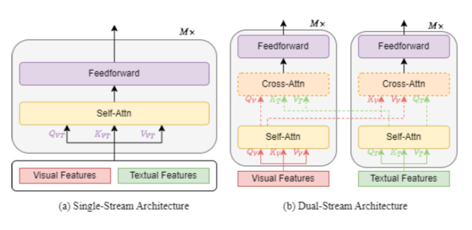

<!--more-->

理清多模态模型，核心是明确不同多模态模型在模型结构，特征提取，和预训练任务三个方面考虑。最后对VL下游任务进行简单介绍。

### 模型结构：

模型结构上，主要分为单流模型和双流模型。单流模型将图像侧和文本侧的embedding拼接到一起，输入到一个Transformer模型中。而双流模型让图像侧和文本侧使用两个独立的Transformer分别编码，并且可以在中间层加入两个模态之间的Attention来融合多模态信息。单流模型和双流模型的基本结构图如下。

### 特征提取:

>  特征提取主要任务是Vision-Langue Pre-training（VLP）任务如何预处理和表示图像、视频和文本以获得对应特征。

1. #### 图像特征提取

   - **OD-based Region Features(OD-RFs).**OD-based Region Features利用一个前置的目标检测模型识别图像中的目标区域（region），并提取每个region的表示，作为图像侧输入。
   - **CNN-based Grid Features(CNN-GFs).** CNN-based Grid Features直接使用如ResNet等CNN模型，在原始图像上提取信息，将CNN最终的输入特征平铺成序列输入到多模态模型中。
   - **ViT-based Patch Features (ViT-PFs).** ViT-based Patch Features借鉴了ViT中patch embedding的方法提取图像信息。

2. #### 视频特征提取

   使用图像特征提取对每一帧提取特征，这些特征被连接为视觉特征，通过一个全连接层映射到与token嵌入空间纬度相同的低位空间。

3. #### 文本特征提取

   在BERT之后，VLP模型先将输入句子分割为一系列子词，然后在序列的开头和结尾插入一个序列开始标记和序列结束标记，以生成输入文本序列。 文本输入表示是通过对相应的词嵌入、文本位置嵌入和文本类型嵌入共同计算。

### 预训练任务：

>  在预训练任务上，主要是如何对齐图像侧和文本侧的信息。

常见的预训练任务主要包括：

- **MaskedLM/PrefixLM**：mask部分token，同时利用剩余的text和图像token预测被mask掉的token
- **Masked Vision Modeling**：mask掉图像的部分patch，然后预测，可以回归也可以分类
- **Vision-Language Matching**：使用image和language的匹配任务作为预训练目标
- **Vision-Language Contrastive Learning**：基于对比学习的图文任务
- **Word-Region Aligment**：对齐vision patch和word
- **Visual Question Answer**：用下游任务，如预测给图问问题预测答案这个任务来训练

### 下游任务：

各种各样的任务需要视觉和语言的合作完成，这里主要介绍VL任务的基本细节和目标，并将其分为五类：分类、回归、检索、生成和其他任务，其中分类、回归和检索任务也称为understanding tasks。

1. #### 分类任务：

   - **Visual Question Answering (VQA).**VQA任务需要从给定的视觉输入（图像或视频）提供问题答案。它被认为是一个分类任务，因为模型需要从一个选择池中预测出最合适的答案。
   - **Visual Reasoning and Compositional Question Answering (GQA).** GQA 是 VQA 的升级版，旨在推进自然场景视觉推理的研究。
   - **Video-Language Inference (VLI).**给定一个以对齐字幕为前提的视频剪辑，再加上基于视频内容的自然语言假设，模型需要推断该假设是否与给定的视频剪辑相矛盾。
   - **Natural Language for Visual Reasoning (NLVR).**它的任务是给定两张图片和一段文字描述，判断该描述是否能（真或假）正确表达两张图像之间的关系。
   - **Visual Entailment (VE).**该任务是给定一张图像，再给定一个假设的文本，需要预测该文本是否蕴含这张图片的含义。
   - **VisualCommonsenseReasoning(VCR).**对于一个问题，有几个替代答案，模型需要选择一个答案，并从几个原因中选择为什么选择这个答案。
   - **Grounding Referring Expressions (GRE).**GRE 任务是在给定文本参考的情况下定位图像区域。 该模型可以为每个区域输出一个得分，得分最高的区域作为预测区域。
   - **Category Recognition (CR).** CR 是指识别产品的类别，这是描述产品的重要属性。

2. #### 回归任务

   - **Multi-modal Sentiment Analysis (MSA).**MSA 旨在通过利用多模态信号（例如，视觉、语言等）来检测视频中的情绪。

3. #### 检索任务

   - **Vision-Language Retrieval (VLR).**VLR 涉及使用适当的匹配策略来理解视觉（图像或视频）和语言领域。 它包括两个子任务，视觉到文本和文本到视觉检索，其中视觉到文本检索是根据视觉从更大的描述池中获取最相关的文本描述，反之亦然。

4. #### 生成任务

   - **Visual Captioning (VC).** VC 旨在为给定的视觉（图像或视频）输入生成语义和句法上适当的文本描述。
   - **Novel Object Captioning at Scale (NoCaps).**NoCaps 扩展了 VC 任务，以测试模型从 Open Images 数据集中描述新对象的能力。
   - **Visual Dialogue (VD).** 给定一个图像或视频，一段历史对话以及一个语言问题，让模型生成一个问题答案。

5. #### 其他任务

   - **Multi-modal Machine Translation (MMT).** 
   - **Vision-Language Navigation (VLN).**
   - **Optical Character Recognition (OCR).**

### 参考

>  Chen F, Zhang D, Han M, et al. VLP: A Survey on Vision-Language Pre-training[J]. arXiv preprint arXiv:2202.09061, 2022.